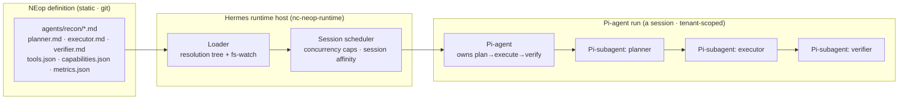
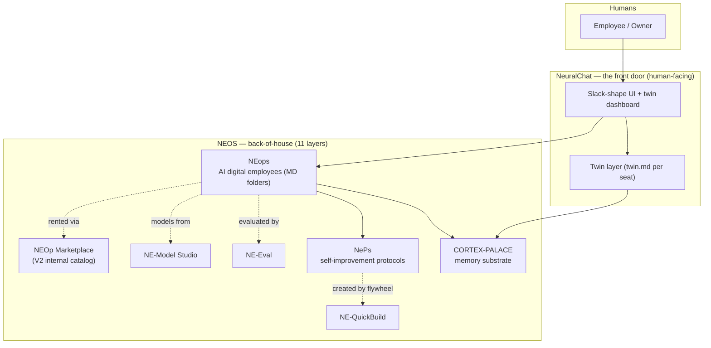
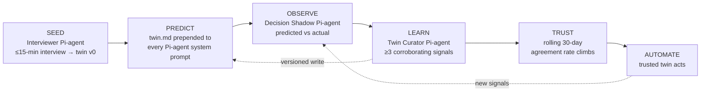
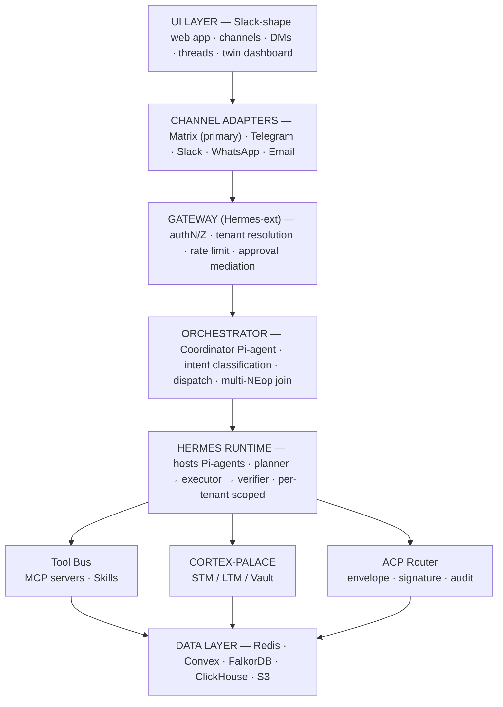
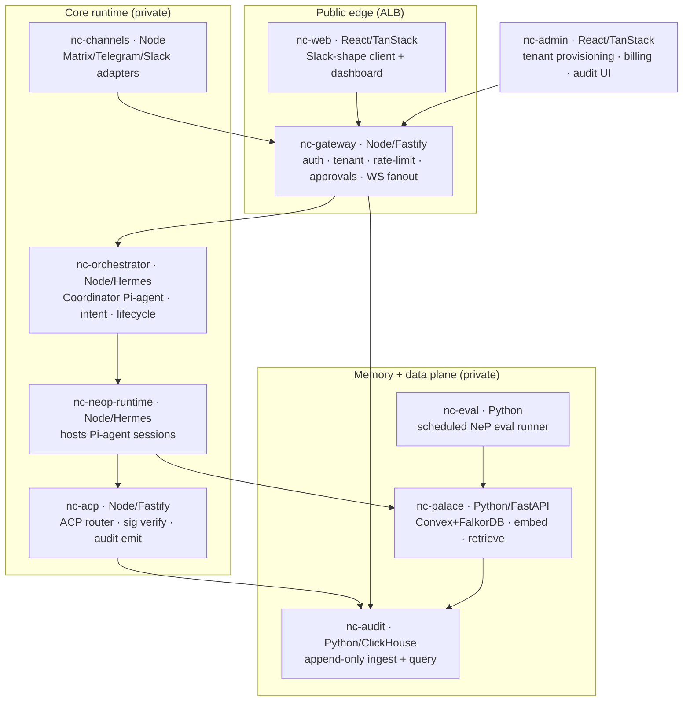
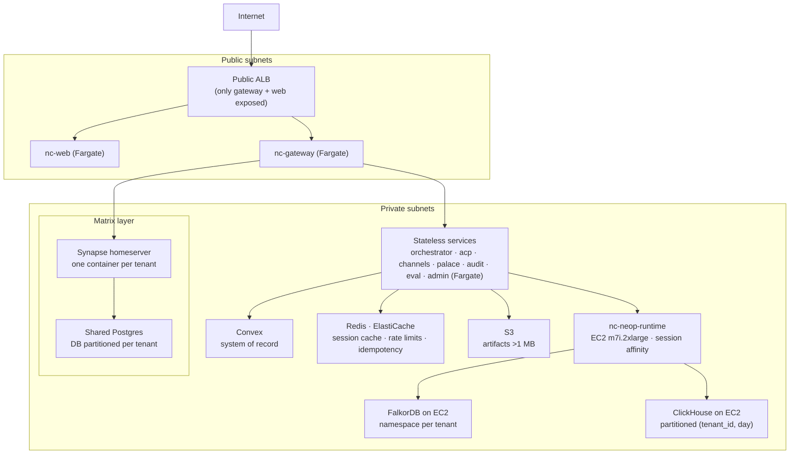
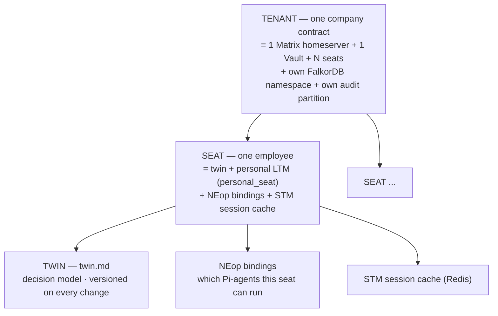
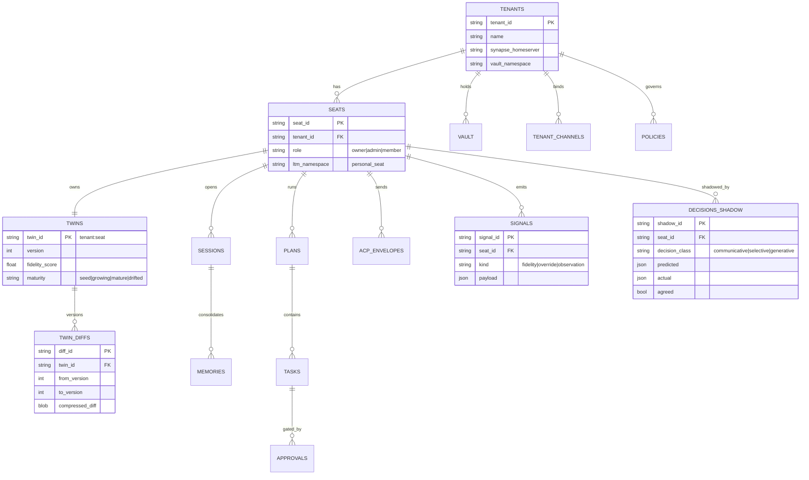

# NeuralChat — End-to-End System Design · **Section 1 of 3**
## Foundation — Substrate, the Hermes/Pi-Agent Runtime & Architecture

| | |
|---|---|
| **Doc ID** | NE-TSD-NC-V2 · S1 |
| **Derives from** | NE-TRD-NC-V0 (locked) + NE-TSD-NC-V1 + codex-hardened blueprint |
| **Owner** | Mansi Gambhir (VP AI Research) |
| **Runtime** | **Hermes** runtime host · **Pi-agents (π-agents)** as the execution unit · Convex · Matrix Synapse |
| **Region** | AWS `ap-south-1` (Mumbai) — cloud-only V1 |
| **Reads with** | S2 (Intelligence: components, memory, twin) · S3 (Runtime & Ops: flows, security, build) |

> **Section 1 scope.** Everything below the user-visible surface: what NeuralChat is, where it sits in NEOS, the runtime model (Hermes hosts Pi-agents), the locked layered architecture and ten-service decomposition, the deployment topology, and the multi-tenant data model. Components and flows are in S2/S3. **The substrate must be correct before any user-visible surface is built.**

---

## 1.0 Runtime naming — read this first

The runtime is referred to throughout all three sections as the **Hermes/Pi-agent runtime**. The terms are precise and not interchangeable:

| Term | What it is | Lifetime |
|---|---|---|
| **Hermes** | The agent **runtime host** — process supervisor, session scheduler, model/tool broker, filesystem-watch loader. Formerly *OpenClaw*; the names are **unified — one and the same**. | Long-lived service (`nc-neop-runtime`, `nc-orchestrator`) |
| **Pi-agent (π-agent)** | The **unit of execution**. A NEop *definition* (a folder of Markdown) is instantiated by Hermes as a **Pi-agent** — a running, tenant-scoped session that owns the plan→execute→verify loop. | Per NEop run (a session) |
| **Pi-subagent** | A Pi-agent spawns three **Pi-subagents** — `planner`, `executor`, `verifier` — each a bounded model call with its own MD prompt. | Per phase, within a run |
| **NEop** | The **definition**: `agents/<name>/*.md` + JSON sidecars. Static, version-controlled. Becomes a Pi-agent only when Hermes loads and runs it. | Indefinite (git) |

**Rule of thumb for the rest of the spec:** wherever V1 said "NEop runtime" read "Hermes"; wherever it said "a NEop run" read "a Pi-agent session"; the planner/executor/verifier are Pi-subagents.

---

## 1.1 What NeuralChat is, and where it sits in NEOS

NeuralChat is an **execution layer for AI-based knowledge work** and the **only human-facing layer of NEOS** — NeuralEDGE's 11-layer Digital AI Operating System. Every other NEOS layer is back-of-house; NeuralChat is the front door. Each employee gets one AI assistant that builds a **twin** (`twin.md`, a versioned decision model of how they work) and, over 6–12 months, automates parts of their job.

**NeuralChat's four jobs in the system:** (1) capture the work context NEOS needs to automate; (2) be the trust-and-approval layer before deeper automation; (3) route work to the right NEop; (4) connect personal context to company Context Vaults.

---

## 1.2 The product model — a closed learning loop

The product is **not** a chatbot; it is a closed loop that converts observation into trustworthy automation. The twin predicts; the user acts; the **Decision Shadow** Pi-agent compares; the **Twin Curator** Pi-agent updates; **fidelity** climbs until the twin can be trusted to act.

**Fidelity is a first-class architectural metric, not marketing.** It is the rolling 30-day agreement rate between twin prediction and user action, computed daily per seat by the Decision Shadow Pi-agent.

| Milestone | Fidelity target | What it unlocks |
|---|---|---|
| Day 0 (seed) | n/a (`maturity: seed`) | Twin prepended but advisory only |
| Day 90 | **≥ 0.65** | Alpha acceptance bar; twin trusted for low-risk inline acts |
| Day 180 | **≥ 0.75** | Paying-tenant bar; broader delegation |

The **conservative ramp** (seed at interview, climb only on corroborated signals) is simultaneously the headline product metric *and* the top sales risk — so it is engineered, measured, and surfaced rather than asserted.

---

## 1.3 Locked layered architecture (TRD §3.1)

Every inbound message walks the **same vertical path**. Three substrates fan out beneath the Hermes runtime. The shape is **locked** — components plug into it, they don't reshape it.

Request path runs **top-to-bottom**; the three substrates (Tool Bus, CORTEX-PALACE, ACP) fan out from the runtime; the data layer sits along the base. Detailed per-component specs are in **S2**.

---

## 1.4 Ten-service decomposition (TRD §3.2)

Internal transport: **HTTP/2 (gRPC where ergonomic)**, **NATS** for event fanout. Every call carries a **W3C trace context** (`traceparent`) and an **`X-NC-Tenant-Id`** header — no exceptions.

| Service | Stack | Owns | Stateful? |
|---|---|---|---|
| `nc-gateway` | Node · Fastify | Auth, tenant resolution, rate limit, approvals, WS fanout | No (Fargate) |
| `nc-orchestrator` | Node · **Hermes** | Coordinator Pi-agent, intent routing, NEop lifecycle | No (Fargate) |
| `nc-neop-runtime` | Node · **Hermes** | Hosts **Pi-agent sessions**; model & tool calls | **Yes** — session affinity (EC2) |
| `nc-palace` | Python · FastAPI | Memory — Convex + FalkorDB, embedding, retrieval | No (Fargate) |
| `nc-acp` | Node · Fastify | ACP router, signature verification, audit emitter | No (Fargate) |
| `nc-channels` | Node · adapters | Matrix / Telegram / Slack adapters | No (Fargate) |
| `nc-web` | React · TanStack Start | Slack-shape client + dashboard | No (Fargate) |
| `nc-admin` | React · TanStack Start | Tenant provisioning, billing, audit UI | No (Fargate) |
| `nc-audit` | Python · ClickHouse | Append-only audit ingestion + query | No (Fargate) |
| `nc-eval` | Python | Scheduled NeP eval runner | No (Fargate) |

**Why `nc-neop-runtime` is the one stateful service:** a Pi-agent session is long-lived (a NEop run can be ≤30s synchronous-feeling or minutes for deep work), holds an in-flight plan DAG + STM working set, and must survive the approval round-trip without losing state. It gets EC2 session affinity; everything else is stateless on Fargate.

---

## 1.5 Deployment topology — AWS `ap-south-1` (TRD §3.3)

Cloud-only, **Mumbai region** for V1 (DPDP data residency). A public ALB exposes **only `nc-gateway` and `nc-web`** — everything else lives in private subnets. Multi-region is V2.

| Concern | Decision |
|---|---|
| Compute (stateless) | ECS Fargate — all stateless services |
| Compute (stateful) | EC2 `m7i.2xlarge` — `nc-neop-runtime` (Pi-agent session affinity) |
| Networking | VPC — public ALB fronts `nc-gateway` + `nc-web` only; rest private |
| System of record | Convex — config, twins, plans, sessions |
| Graph | FalkorDB on EC2 — namespace per tenant |
| Audit | ClickHouse on EC2 — partitioned `(tenant_id, day)` |
| Artifacts >1 MB | S3 |
| Cache / rate limit / idempotency | Redis · ElastiCache |
| Channels | One Synapse container **per tenant**, shared Postgres, DB partitioned per tenant |

**Provisioning a new tenant is a Terraform-automated unit:** Synapse container + Vault namespace + audit partition + per-tenant keys, applied as one module.

---

## 1.6 Multi-tenancy — the isolation backbone (TRD §1.5, §5)

**`tenant_id` is the universal access key — no code path issues a read or write without it.** The hierarchy is strict; isolation is enforced **independently at four layers** (full ACL in S3 §3.2).

| Property | V1 | V2 |
|---|---|---|
| Seats / tenant | ≤ 20 | up to 200 |
| Concurrent Pi-agent runs / tenant | 16 | 50 |

**Isolation invariant (NFR-10):** No Pi-agent in tenant A can read tenant B data. Enforced at the gateway **AND** the PALACE client **AND** the ACP router — defense in depth, no single layer trusted.

---

## 1.7 Data model — three stores, one responsibility each (TRD §5)

Convex is the **system of record**; FalkorDB owns the **graph**; ClickHouse owns **audit volume**.

### 1.7.1 Convex — system of record (15 collections)

Full collection list: `tenants · seats · twins · twin_diffs · sessions · memories · vault_<tenant> · plans · tasks · approvals · acp_envelopes · signals · decisions_shadow · tenant_channels · policies`.

### 1.7.2 FalkorDB — graph (Graphiti temporal layer)

- **Per tenant** `vault_<tenant>` — org knowledge + hierarchy graph.
- **Per seat** `personal_<seat>` — relationships, decisions, project graph.
- **Graphiti** adds temporal edges + multi-hop Cypher; retrieval detail in **S2 §2.5**.

### 1.7.3 ClickHouse — audit volume

- `audit_events` — append-only, partitioned `(tenant_id, day)`.
- `neop_traces` — flattened OTel for cost/perf analysis.
- `acp_envelopes` migrate here in V2 when volume warrants.

### 1.7.4 Retention & lifecycle (TRD §5.4)

| Data type | Retention | Reason |
|---|---|---|
| Active twin | Indefinite | Live operating data |
| Twin diff history | Indefinite · compressed | Rollback + audit |
| STM — sessions | 30d hot → consolidated | Performance |
| LTM | Until seat deletion | Twin learning |
| Vault | Until tenant offboard | Org memory |
| Audit log | **7 years** | DPDP / SOX-ready |
| Decision shadow | 90 days | 30d window + analysis |
| ACP envelopes | 90d hot → S3 archive | Volume |

> **Deletion-routing (V1+ blocker).** An audit-relevant event can live in four stores — local `audit.jsonl`, the Cortex audit wing, Matrix room history, the Companion Channels feed. A deletion request must reach **all four** atomically, with CI restore-tests. Tracked as a gating item; design lands in S3.

---

### Section 1 → Section 2 handoff

S1 fixed the substrate: the Hermes/Pi-agent runtime model, the locked layering, ten services, the deployment, and the multi-tenant data model. **S2 (Intelligence)** specifies each component in depth — the gateway trust seam, channel adapters, the orchestrator's intent classifier, the Hermes/Pi plan-execute-verify engine, the CORTEX-PALACE retrieval fusion, the twin layer and its maturity state machine, the ACP router, and the six meta-NEops realized as Pi-agents.
