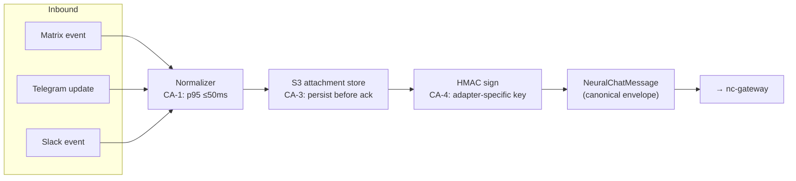
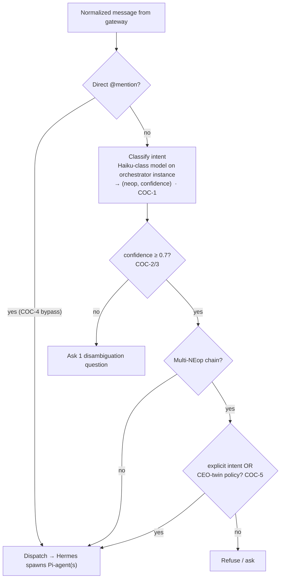
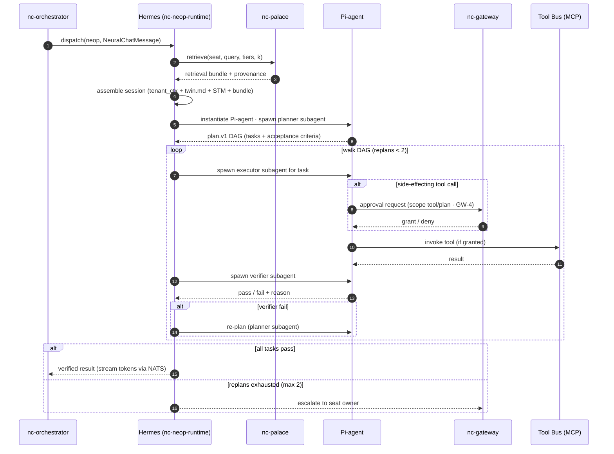
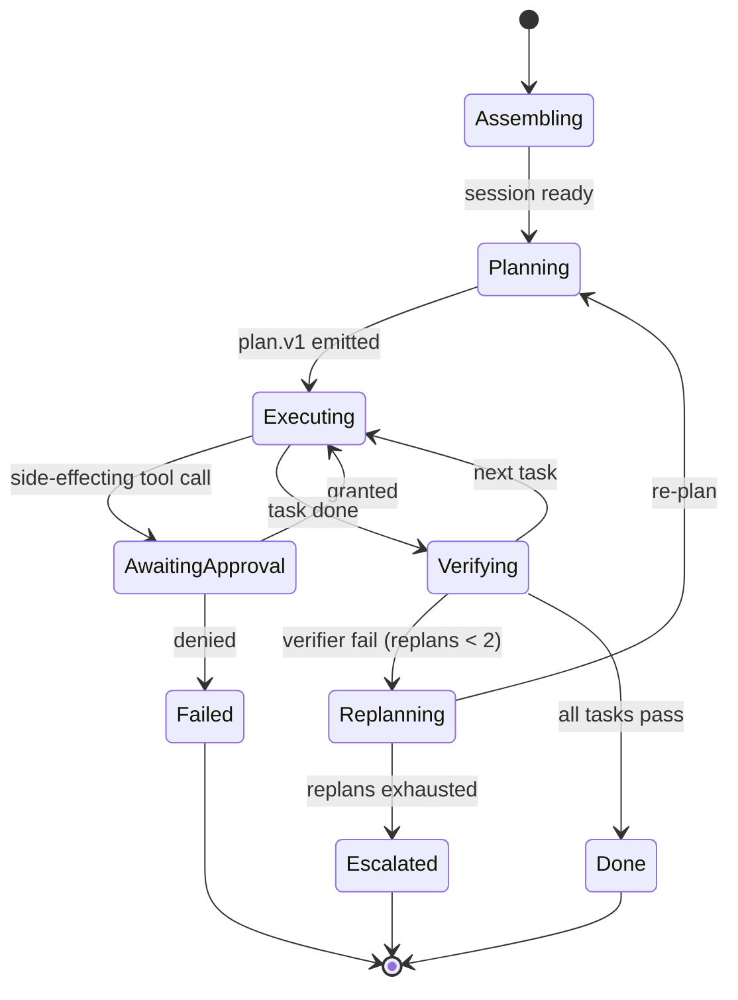
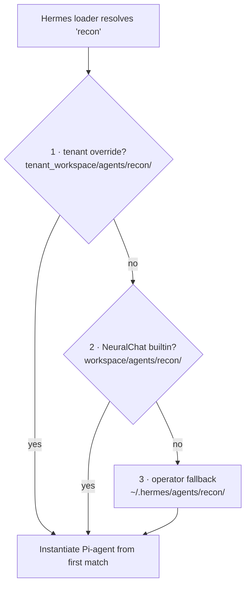
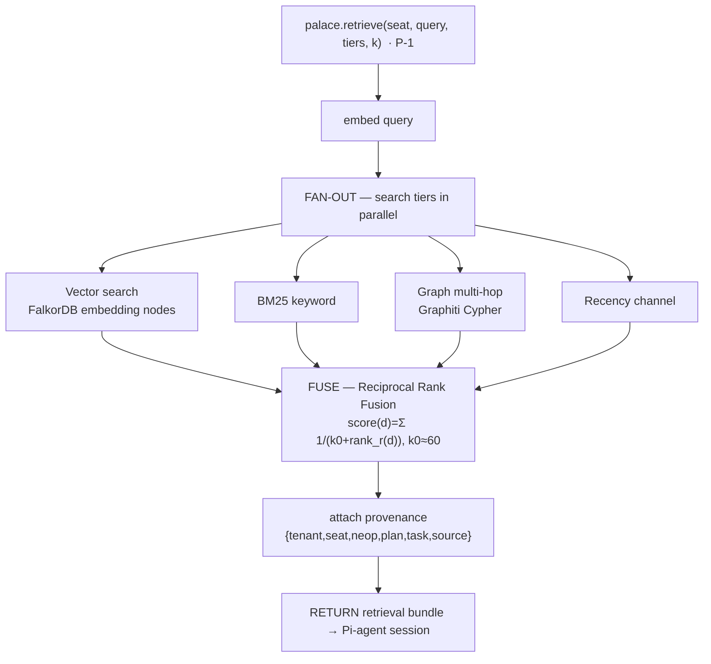
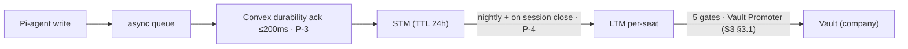
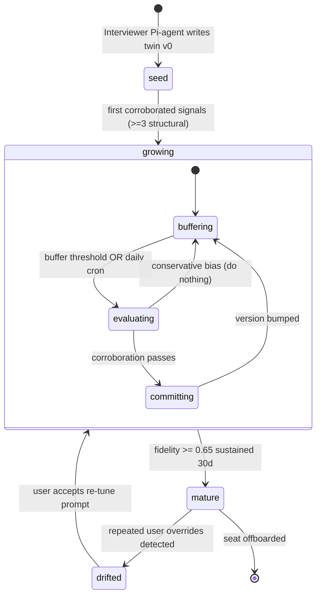
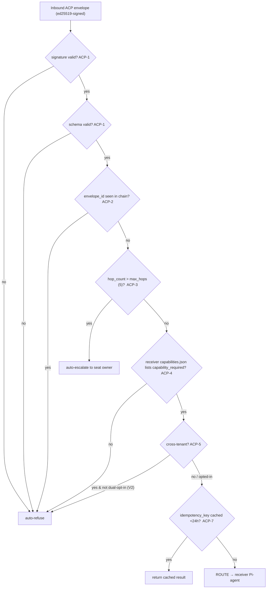
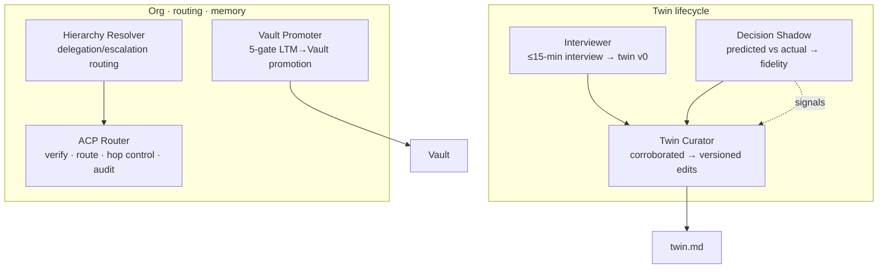

# NeuralChat — End-to-End System Design · **Section 2 of 3**
## Intelligence — Components, the Hermes/Pi Runtime Engine, Memory & the Twin

| | |
|---|---|
| **Doc ID** | NE-TSD-NC-V2 · S2 |
| **Owner** | Mansi Gambhir (VP AI Research) |
| **Runtime** | **Hermes** host · **Pi-agents** execute · planner/executor/verifier are **Pi-subagents** |
| **Reads with** | S1 (Foundation) · S3 (Runtime & Ops) |

> **Section 2 scope.** Each component on the request path, specified to build depth: the gateway trust seam, channel adapters, the orchestrator's intent classifier, the **Hermes/Pi plan-execute-verify engine**, the CORTEX-PALACE retrieval substrate, the twin layer and its maturity machine, the ACP router, and the six meta-NEops. Runtime flows that *cross* components live in S3.

---

## 2.1 Gateway — the trust seam (TRD §4.1)

`nc-gateway` terminates every inbound channel, resolves identity → tenant, and mediates approvals **before any Pi-agent sees the request**. One auth, one rate limiter, one audit seam, one approval chokepoint.

```mermaid
sequenceDiagram
    autonumber
    participant CH as Channel adapter
    participant GW as nc-gateway
    participant RD as Redis
    participant OPA as OPA/Rego
    participant AUD as nc-audit
    participant ORC as nc-orchestrator

    CH->>GW: NeuralChatMessage (HMAC-signed)
    GW->>GW: verify adapter HMAC (CA-4)
    GW->>RD: resolve tenant_id, seat, role, policy (GW-2 ≤30ms)
    RD-->>GW: tenant context (cached)
    GW->>RD: rate-limit check (GW-3: 60/min/seat · 16 runs/tenant)
    alt over limit
        GW-->>CH: HTTP 429
    else within limit
        GW->>OPA: gated action? evaluate policy
        OPA-->>GW: allow / require-approval / deny
        alt require-approval (GW-4 scopes: command|tool|neop|plan)
            GW->>AUD: emit approval-request audit event (GW-6)
            GW-->>CH: surface approval card; await resolve
        end
        alt deny (denyCommands · GW-5 non-overridable)
            GW->>AUD: emit denied event
            GW-->>CH: refused
        else allow
            GW->>ORC: forward normalized NeuralChatMessage
        end
    end
```

| Req | Spec |
|---|---|
| GW-1 | Matrix-token auth V1; SSO/OIDC (tenant-managed) V2 |
| GW-2 | Tenant resolution ≤ 30 ms — Redis-cached |
| GW-3 | Rate limit **60 msg/min/seat**, **16 concurrent Pi-agent runs/tenant** |
| GW-4 | Approval mediation across four scopes: **command · tool · NEop · plan** |
| GW-5 | Hard-deny list (`denyCommands`) is **non-overridable** |
| GW-6 | Every approval request emits a full-context audit event |

**Approval scopes (GW-4).** A scope is the *granularity* at which the user is asked to consent before a Pi-agent proceeds: `command` (a raw user-issued imperative), `tool` (a single side-effecting MCP call), `neop` (running a whole Pi-agent), `plan` (approving an entire plan.v1 DAG up front). The executor Pi-subagent blocks on the gateway for `tool`/`plan` scopes mid-run (see §2.4).

---

## 2.2 Channel adapters — one canonical envelope (TRD §4.2)

Each adapter in `nc-channels` normalizes inbound channel events into **one canonical shape** and renders outbound responses back to channel-native format.



```jsonc
{
  "msg_id":          "msg_01HXXX...",
  "tenant_id":       "acme",
  "channel":         "matrix | telegram | slack",
  "conversation_id": "conv_01HXXX...",
  "thread_id":       "thread_..." ,            // or null
  "user_id":         "acme:mansi-gambhir",
  "text":            "string",
  "attachments":     [{ "type": "...", "url": "s3://..." }],
  "mentions":        [{ "actor": "@recon" }],
  "ts":              "ISO 8601",
  "metadata":        {}
}
```

| Req | Spec |
|---|---|
| CA-1 | Inbound normalization p95 ≤ 50 ms |
| CA-2 | Outbound rendering preserves message ordering within a conversation |
| CA-3 | Attachments persisted to S3 **before** the message is acked |
| CA-4 | Every adapter→gateway call **HMAC-signed** with an adapter-specific key |
| CA-5 | Matrix — Synapse **Application-Service API; one AS per tenant** |

---

## 2.3 Orchestrator — intent to dispatch (TRD §4.3)

The **Coordinator Pi-agent** classifies intent, dispatches to the right NEop or composes a multi-NEop response, and stitches streaming output back to the channel.



- **COC-1** — classifier is a small, fast model co-located on the orchestrator instance (cheap, sub-second).
- **COC-4** — a direct `@recon` mention **bypasses classification** and dispatches immediately.
- **COC-5** — multi-NEop chains (Recon → Account Researcher → Proposal Writer) require explicit user intent **or** CEO-twin policy authorization.

---

## 2.4 Hermes/Pi runtime — the plan-execute-verify engine (TRD §4.4)

This is the heart of the system. Hermes assembles a **session**, instantiates a **Pi-agent**, and the Pi-agent runs a bounded **planner → executor → verifier** loop using three Pi-subagents.

### 2.4.1 Session assembly

Every Pi-agent run receives, before the first model call:

```
session = tenant_ctx                       # tenant_id, policies, channel
        + twin.md (prepended to sys prompt) # T-5: the decision model
        + recent STM                        # last-N messages, active task ctx
        + PALACE retrieval bundle           # palace.retrieve(seat, query, tiers, k)
```

### 2.4.2 The run, end to end



### 2.4.3 Run state machine



| Req | Spec |
|---|---|
| NR-1 | Loader walks the resolution tree on boot **and** on filesystem-watch events |
| NR-2 | Frontmatter parsed against JSON Schema; failures **block boot** with named errors |
| NR-3 | Each run = a session: `tenant_ctx + twin + recent STM + PALACE bundle` |
| NR-4 | Planner emits `plan.v1` DAG; executor walks it; verifier checks acceptance criteria |
| NR-5 | Re-plan on verifier failure up to `max_replans` (2), then escalate |
| NR-6 | All executor tool calls pass through gateway approval mediation (GW-4) |
| NR-7 | Runtime emits OTel spans per plan / execute / verify phase |

### 2.4.4 `plan.v1` DAG (emitted by the planner Pi-subagent)

```jsonc
{
  "plan_version": "v1",
  "plan_id": "plan_01HXXX...",
  "neop": "recon",
  "tasks": [
    {
      "task_id": "t1",
      "description": "Find 20 ICP-matching agencies in Delhi NCR",
      "depends_on": [],
      "tool": "browser_agent",
      "acceptance": "≥20 rows with name, domain, contact; deduped",
      "scope": "tool"
    },
    {
      "task_id": "t2",
      "description": "Enrich each with firmographics",
      "depends_on": ["t1"],
      "tool": "enrichment_mcp",
      "acceptance": "≥80% rows enriched; provenance attached",
      "scope": "tool"
    }
  ],
  "max_replans": 2
}
```

### 2.4.5 A NEop is a folder of Markdown — the resolution tree



```
agents/<neop-name>/
  neop.md            main definition + role prompt
  planner.md         planner Pi-subagent prompt
  executor.md        executor Pi-subagent prompt
  verifier.md        verifier Pi-subagent prompt
  tools.json         tool whitelist
  metrics.json       NeP metrics
  capabilities.json  ACP capability publication
  fixtures/
    eval.jsonl       evaluation set
    golden_plans/    regression reference plans
```

**First match wins** → a tenant overrides any builtin NEop **without forking the platform**.

---

## 2.5 CORTEX-PALACE — the memory substrate (TRD §4.5)

Tiered by **scope and lifetime**. STM is a fast session cache; LTM is per-seat and private; the Vault is per-tenant company knowledge.

| Tier | Lifetime | Backing | Access |
|---|---|---|---|
| **STM** | TTL 24h | Convex `sessions` (+ Redis hot) | last-N messages, active task context |
| **LTM (personal)** | indefinite | Convex `memories` + FalkorDB `personal_<seat>` | episodic · semantic · procedural · decisions |
| **Vault (company)** | indefinite | Convex `vault_<tenant>` + FalkorDB `vault_<tenant>` | org-wide knowledge · hierarchy graph |

### 2.5.1 Retrieval — fan-out + Reciprocal Rank Fusion



**Reciprocal Rank Fusion** merges the four ranked lists without tuning per-channel weights: `score(d) = Σ_r 1 / (k0 + rank_r(d))` with `k0 ≈ 60`. The fused top-k bundle, each chunk carrying provenance, is what gets injected into the Pi-agent session.

| Req | Spec |
|---|---|
| P-1 | `palace.retrieve(seat, query, tiers, k) → ranked chunks with provenance` |
| P-2 | p95: STM ≤100ms · LTM ≤400ms · Vault ≤600ms · multi-hop ≤1.2s |
| P-3 | Writes async-queued; durability ack ≤200ms via Convex |
| P-4 | STM→LTM consolidation nightly + on session close; LTM→Vault needs Vault Promoter |
| P-5/6 | Every write carries provenance; cross-tenant read **rejected at the PALACE client** |

### 2.5.2 Write path & consolidation



**Source-of-truth split:** local working memory owns the live scratchpad; Cortex owns durable promoted facts. **Drift surfaces as a dashboard alert — never a silent merge.**

### 2.5.3 Embedding strategy

| Phase | Model | Dim | Host |
|---|---|---|---|
| V1 dev/staging | Gemini `embedding-001` | 768 | API |
| V2 prod / PrivatNEOS | Qwen3-Embedding-8B | 4096 | **self-hosted** |

Two-phase index — **hot:** FalkorDB embedding nodes · **cold:** S3 + on-demand re-rank.

---

## 2.6 Twin layer — `twin.md` (TRD §4.7)

One canonical `twin.md` per seat, in Convex, **versioned on every change** with a separate compressed diff, **prepended to every Pi-agent run's system prompt**.

```yaml
---
twin_id: <tenant>:<seat>
version: <monotonic int>
fidelity_score: <0..1>
maturity: seed | growing | mature | drifted
locale: ...
identity: ...
communication: ...
decision_style: ...
working_hours: ...
relationships: []
active_projects: []
priorities: ...
delegation_policy: ...
signals:
  observed_decisions: ...
  shadow_predictions: ...
  agreement_rate_30d: ...
  drift_areas: []
  recent_overrides: ...
---
# Identity narrative
# Decision lens
# How to write as <name>
```

### 2.6.1 Twin maturity state machine (driven by the Twin Curator Pi-agent)



| Req | Spec |
|---|---|
| T-1 | Canonical `twin.md` in Convex; every change = full file + new version + diff |
| T-2 | Diff history kept indefinitely; rollback API restores any prior version |
| T-3 | Latest version cached in Redis — TTL 5 min, invalidated on write |
| T-4 | **Only Twin Curator + the seat owner can write**; all else read-only |
| T-5 | Every Pi-agent run prepends `twin.md` to its system prompt before the model call |
| T-6 | Updates need ≥N corroborating signals — **N=3 structural, N=1 additive** |

---

## 2.7 ACP router — signed inter-agent messaging (TRD §4.6)

Every inter-Pi-agent message is a **signed envelope**. `nc-acp` verifies signature, schema and hop count **before routing**, and appends every envelope to the audit log. (Cross-component delegation flow is in S3 §3.1.)



```jsonc
{
  "acp_version": "1.0",
  "envelope_id": "...", "conversation_id": "...", "ts": "...",
  "from": { "tenant": "...", "actor": "...", "type": "..." },
  "to":   { "tenant": "...", "actor": "...", "type": "..." },
  "intent": "request_input | delegate | redirect | escalate | inform | refuse",
  "capability_required": "...", "scope": [],
  "payload": { /* schema per intent */ },
  "hop_count": 0, "max_hops": 5, "parent_envelope_id": "...",
  "signature": "ed25519:...", "idempotency_key": "..."
}
```

---

## 2.8 Six meta-NEops — the platform, as Pi-agents (TRD §4.8–4.10)

V1 builds six meta-NEops (each a Pi-agent). Three own twin creation/lifecycle; three own org structure, routing and memory promotion.



| Meta-NEop (Pi-agent) | Role |
|---|---|
| **Interviewer** | ≤15-min onboarding interview (80-question pool, 5 role families) → twin v0 |
| **Twin Curator** | Continuous per-seat worker; evolves `twin.md`; conservative bias |
| **Decision Shadow** | Shadows observable decisions; computes rolling 30-day fidelity |
| **Hierarchy Resolver** | Resolves org-chart relationships for delegation/escalation |
| **ACP Router** | Envelope verification, routing, hop control, audit emission |
| **Vault Promoter** | Gatekeeps LTM→Vault promotion through the 5 gates |

**Plus re-wraps:** Recon, ICD, Chief of Staff, TeamPulse re-wrapped onto the planner→executor→verifier contract — 27 NEops named in the catalog, ~25 more in Tier 2.

---

### Section 2 → Section 3 handoff

S2 specified every component as it sits on the request path. **S3 (Runtime & Ops)** shows them working together: the eight end-to-end flows (onboarding, chat round-trip, Pi-agent run, memory promotion, Decision Shadow/fidelity, twin evolution, delegation, the automation flywheel), then the four-layer ACL and full security posture, reliability/DR, compliance, and the 90-day critical-path build with acceptance criteria.
