# NeuralChat — End-to-End System Design · **Section 3 of 3**
## Runtime & Operations — Flows, Security, Reliability & the Build

| | |
|---|---|
| **Doc ID** | NE-TSD-NC-V2 · S3 |
| **Owner** | Mansi Gambhir (VP AI Research) |
| **Runtime** | **Hermes** host · **Pi-agents** execute |
| **Reads with** | S1 (Foundation) · S2 (Intelligence) |

> **Section 3 scope.** The system *running*: the eight end-to-end flows that cross components, the four-layer tenant-isolation ACL, the full security posture, reliability/DR, compliance, and the dependency-ordered 90-day build with acceptance criteria and risks.

---

## 3.1 The eight end-to-end flows

### Flow 1 — Onboarding seeds twin v0 (TRD §4.8)

The **Interviewer Pi-agent** turns a ≤15-minute conversation into a structured twin file. Onboarding *is* the day-one self-model build.

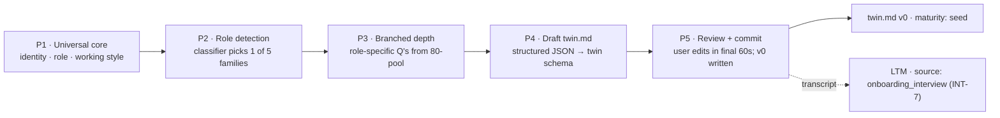

- **INT-1/4** — 15-min wall-clock cap; each phase has min/max question count + time budget.
- **INT-8** — re-runnable on role change; replaces twin v0 but **preserves accumulated signals** via the Twin Curator.

---

### Flow 2 — A chat message round-trip (TRD §3.1, NFR-1)

The latency-critical path. **Budget: p50 ≤ 800 ms, p95 ≤ 2 s** (excluding Pi-agent work).

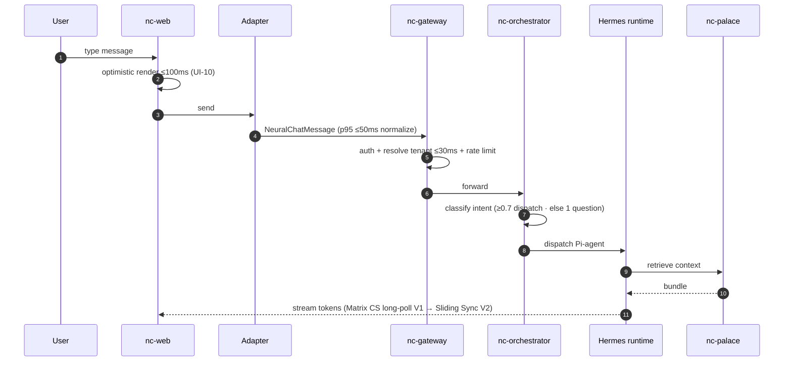

### Flow 3 — Request lifecycle, gate by gate

Two decision gates stand between an inbound message and a Pi-agent run.

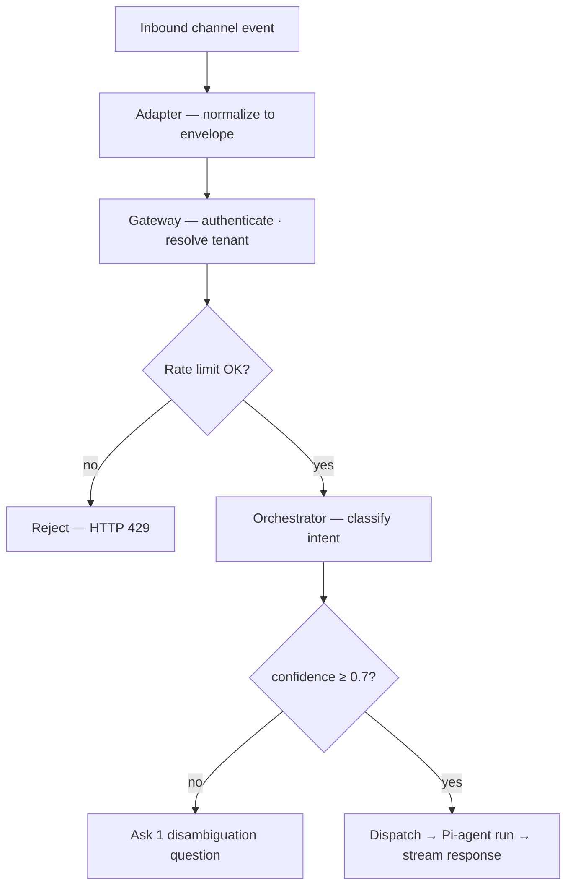

> The internal **plan-execute-verify sequence** and **run state machine** for a Pi-agent live in **S2 §2.4** — this flow stops at dispatch.

---

### Flow 4 — Memory write & promotion (TRD §4.5, blueprint §4.2)

A fact graduates from "I noticed this" to "the company knows this" **only by passing five gates** — the sole path data leaves a seat's private surface.

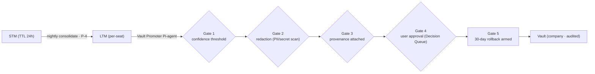

| Gate | Check |
|---|---|
| 1 | Confidence threshold — wing-specific minimum bar |
| 2 | Redaction — automated PII/secret scan masks values |
| 3 | Provenance — source, line, timestamp, origin attached |
| 4 | User approval — Promote / Edit / Reject in the Decision Queue |
| 5 | 30-day rollback — reversible, with a do-not-re-promote marker |

---

### Flow 5 — Decision Shadow & fidelity (TRD §4.10)

On every observable decision, the **Decision Shadow Pi-agent** runs the twin's prediction **in parallel — never blocking** — and feeds divergence into the fidelity score.

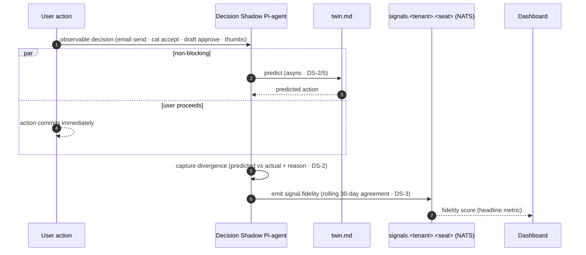

- **DS-4 classes** — V1 tracks **communicative** (text-comparable) + **selective** (binary/n-ary); generative tracked qualitatively only.
- **DS-6 budget** — ≤ 50 shadows/day per seat, prioritized by class — cost-bounded by design.
- **Fidelity** — `agreement_rate_30d = (class-weighted agreed shadows) / (scored shadows)` over the trailing 30 days. Target **0.65 @ D90 → 0.75 @ D180**.

---

### Flow 6 — The twin evolves (TRD §4.9)

The **Twin Curator Pi-agent** turns a signal stream into careful, corroborated, versioned edits — and never overwrites lightly.

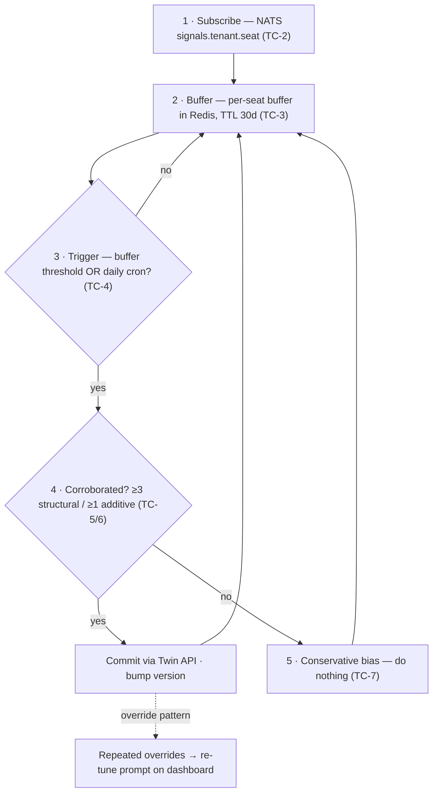

**Drift, not silent rewrite:** when the user repeatedly overrides the twin, drift is **surfaced as a re-tune prompt** — the system asks, it does not assume.

---

### Flow 7 — Inter-agent delegation (TRD §4.7)

When one Pi-agent needs another, it sends a **signed ACP envelope**. The router is the single chokepoint where every safety check fires before routing (verification pipeline detailed in S2 §2.7).

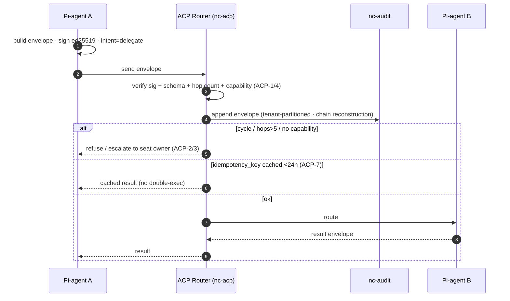

Cross-tenant delegation is **V2 only**, and only when **both** tenant policies have explicitly opted in (ACP-5); otherwise rejected at the gateway.

---

### Flow 8 — The automation flywheel (blueprint §7)

The product's compounding loop: NeuralChat observes and surfaces; the user approves; small work runs inline, recurring work becomes a NeP, big work becomes a new NEop.

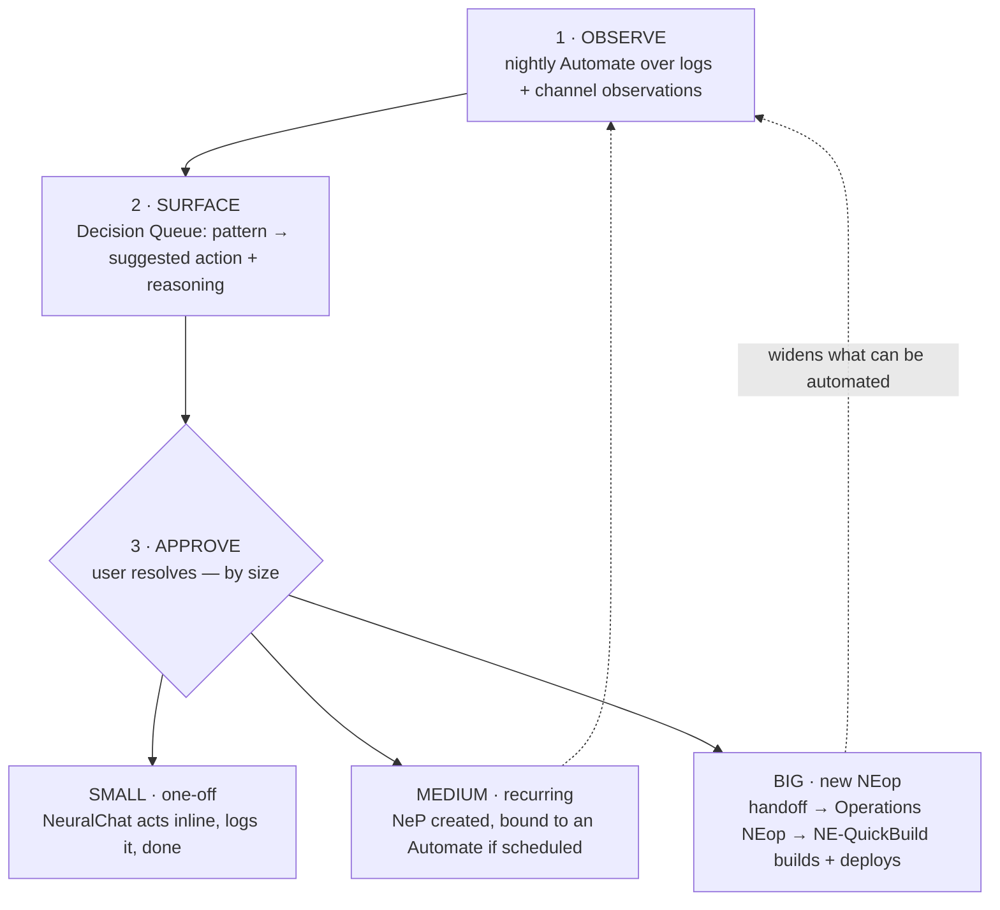

**V0 scope:** NeuralChat sends the handoff message and stops — the receive side (interview-to-spec, spec-to-NEop, integration receipt) is V1, gated on the **Integration-Receipt Allowlist**.

---

## 3.2 Security (TRD §7)

### 3.2.1 Tenant isolation — four-layer ACL (TRD §7.5, blueprint §4.2.4)

"Scoped Pi-agent can read company wings but only write its own room" is enforced **independently at four layers — no layer trusts another alone**.

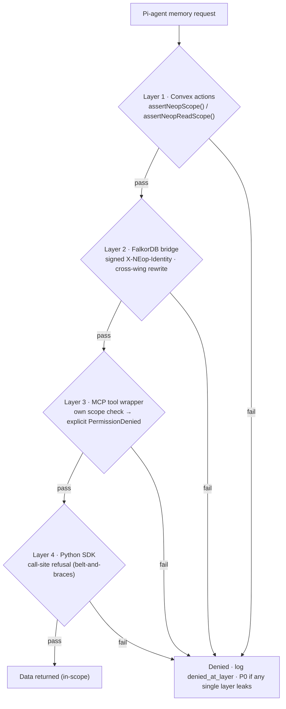

**Test invariant:** CI runs an ACL suite against **all four** layers. A bypass at any single layer is a **P0 bug**; every denied operation logs `denied_at_layer` to catch a layer silently passing.

### 3.2.2 Auth · authz · encryption · secrets

| Domain | Spec |
|---|---|
| **Authentication** | Matrix-token (V1) → SSO/OIDC (V2); service-to-service **mTLS in VPC + per-service keys**; tool creds in **AWS Secrets Manager — never env vars**; ACP envelopes **Ed25519-signed, keys rotate quarterly** |
| **Authorization** | Three role tiers — **owner · admin · member**; **OPA/Rego** on every gated action; PALACE client enforces `(seat, tenant)` on every op |
| **Encryption** | TLS 1.3 all traffic; at rest **AWS KMS per-tenant CMK** (V2); Matrix **Megolm E2EE** by default; twin file seat-derived key (V2) |
| **Audit (SEC-12…15)** | Every state change logs **who · when · what · on whom · with what permission · result**; append-only, tenant-partitioned; customer export ≤24h; staff access reason-gated + audited |
| **Secrets posture** | V0 accepts `chmod-600 .env` (single user). **V1 blocker:** all secrets → OS keychain via Python `keyring` **before user #2 onboards** |

---

## 3.3 Reliability & operations (TRD §8)

### 3.3.1 SLOs

| SLO | Target | Error budget |
|---|---|---|
| Gateway availability | 99.9% | 43.2 min/mo |
| Chat round-trip p95 | ≤ 2 s | 5% of requests |
| Pi-agent run p95 | ≤ 60 s | 5% of runs |
| PALACE retrieval p95 | ≤ 1.2 s | 5% of queries |
| Twin write durability | 100% | 0 — no acked loss |

### 3.3.2 Observability & DR

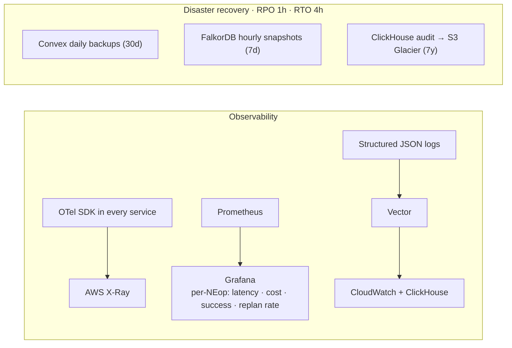

**Incident response:** 24/7 PagerDuty for P0/P1 · public status page · post-incident review within 5 business days, drafted by the **Postmortem Drafter** Pi-agent. RPO 1h / RTO 4h for a full tenant restore — **drilled quarterly**.

---

## 3.4 Compliance & privacy (TRD §9)

| Req | Baseline |
|---|---|
| COM-1 | **DPDP Act 2023 (India)** — V1 must comply; first tenant is India-based |
| COM-2 | SOC 2 Type 1 — target Q4 2026 (V2) |
| COM-3 | GDPR-ready architecture — must not block EU expansion |
| COM-4 | ISO 27001 — target 2027 |
| COM-5 | Data residency — all Indian tenant data stays in `ap-south-1` |

**Privacy commitments:** decision cloning is explicitly disclosed and consented at onboarding · per-class shadow opt-out (communicative / selective / generative independently) · a user can view and correct their own `twin.md` anytime · on offboarding, personal patterns export per company policy · staff access requires a reason, is audited, and is customer-notifiable.

**The ethics line:** decision shadowing is the product's most sensitive surface; the mitigation is **transparency as a first-class feature** — explicit opt-in, per-class controls, and a dashboard that always shows what is being tracked.

---

## 3.5 The build (TRD §10, §15)

### 3.5.1 Locked stack

**Hermes** runtime host · **Pi-agents** as execution unit · Convex (SoT) · FalkorDB + Graphiti · Matrix Synapse · TanStack Start · Node 22 · Python 3.12 · ClickHouse (audit) · NATS (events) · Redis (cache) · OPA/Rego · AWS `ap-south-1` · Gemini → Qwen3 embeddings.

**Models:** Claude Sonnet for planning · GPT-5.4-mini general · Haiku-class classifier. V2 adds ZAI/GLM-5 as a local fallback.

### 3.5.2 Critical path — dependency order

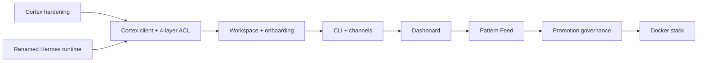

> **The substrate must be correct before any user-visible surface is built.** Cortex hardening and the renamed Hermes runtime run in parallel; everything downstream waits on the Cortex client + four-layer ACL.

### 3.5.3 90-day schedule

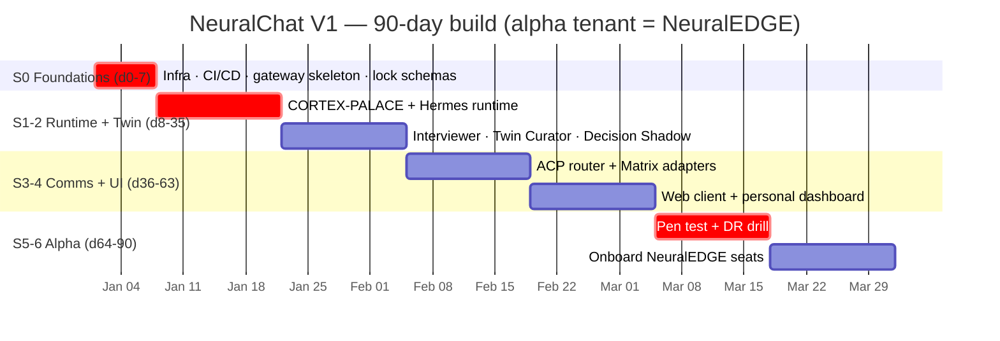

| Sprint | Days | Deliverable |
|---|---|---|
| S0 | 0–7 | Foundations — infra, CI/CD, gateway skeleton, lock schemas |
| S1–2 | 8–35 | Runtime + Twin — PALACE, Hermes runtime, Interviewer, Curator, Shadow |
| S3–4 | 36–63 | Comms + UI — ACP, Matrix, web client, dashboard |
| S5–6 | 64–90 | Alpha — pen test, DR drill, onboard NeuralEDGE seats |

### 3.5.4 V1 acceptance — Day 90

- NeuralEDGE tenant onboarded — ≥5 seats, `twin.md` version ≥5
- ≥3 NEops in regular use per seat
- Average twin fidelity ≥ 0.65 across active seats
- Chat round-trip p95 ≤ 2 s · Pi-agent run p95 ≤ 60 s in production
- **Zero tenant-isolation violations in 30 d** — verified by audit replay
- All 6 meta-NEops live · personal dashboard live · pen test passed

### 3.5.5 Top risks & open questions

- **Fidelity may not hit 0.75 in 90 days** — mitigated by conservative ramp, Shadow tuning, the ≥3-signal rule.
- **Codex review hardened 32 findings** — RCE-equivalent auto-apply (now an allowlist), unspecified ACL (now 4-layer defense in depth), coarse permissions (now 90-day T3 leases).
- **8 open questions lock between Day 14–30** — Synapse topology · event bus · fidelity algorithm · twin commit model · (+4) — each locked before it blocks its dependent sprint.

---

*NeuralChat — the execution layer for AI-based work.*
*NEURALEDGE · SYNLEX TECHNOLOGIES PVT. LTD.*
